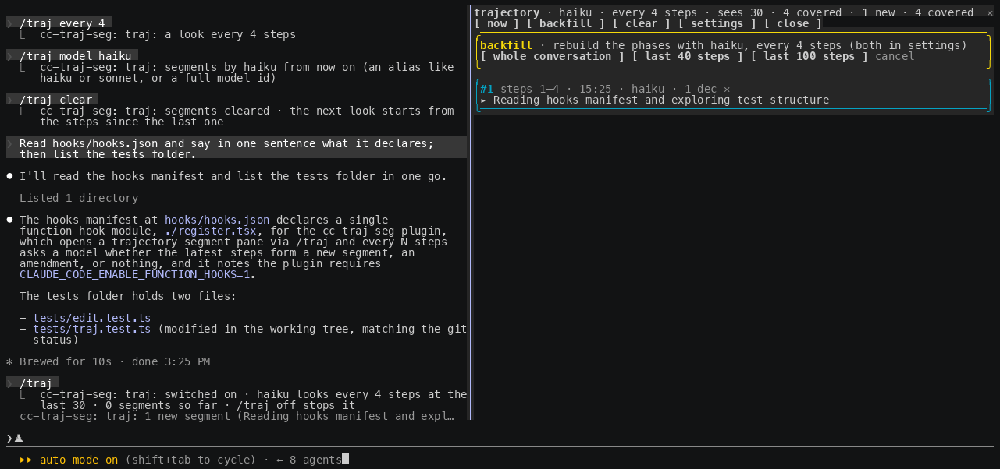
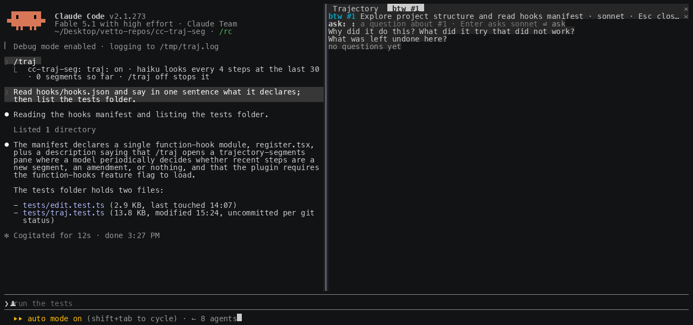
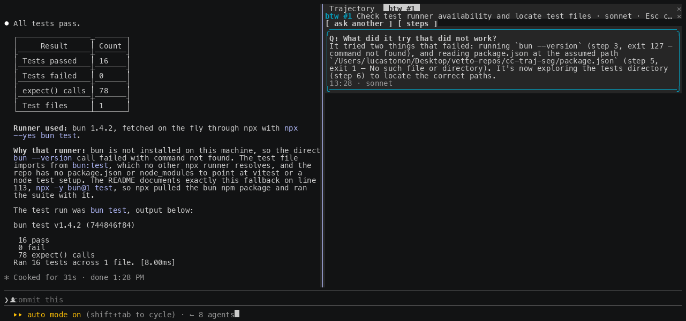
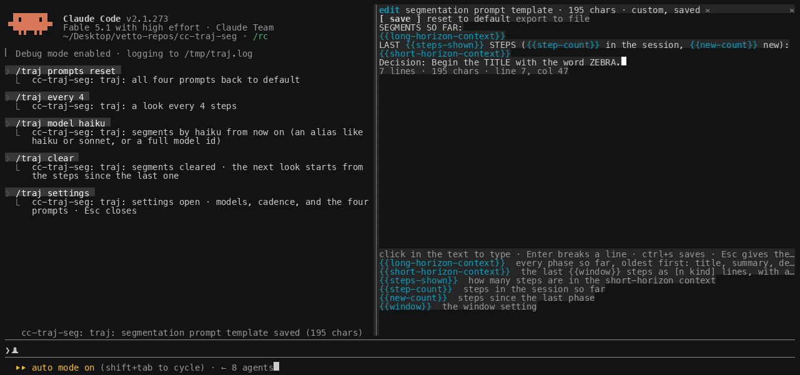
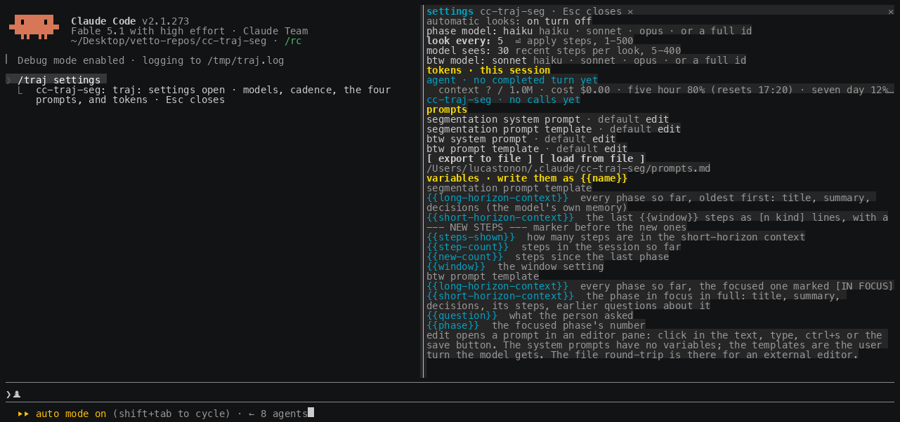
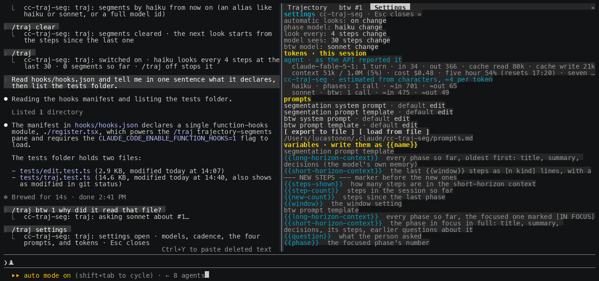

# cc-traj-seg

Trajectory segmentation for long Claude Code sessions: a pane on the right that keeps a running, honest account of what the agent is doing, why, and every decision it makes, broken into short phases you can skim.


## Why this exists

You can delegate intelligence. You cannot delegate understanding.

An agent now runs for tens of minutes and hundreds of tool calls on a single prompt. It reads files, edits them, runs commands, changes direction, recovers from a failed test, and by the time it stops you have a result but no picture of how it got there. The transcript holds every step, yet nobody scrolls back through four hundred lines to reconstruct the plot. So the understanding is simply lost, and you are left trusting an outcome you did not watch being made.

That gap matters more as the models get better, not less. The more capable the agent, the more you hand it, and the more of the actual work happens while you are not looking. Capability you can buy. Legibility you have to build. This plugin spends a little intelligence to buy back the understanding: a small model watches the trajectory and keeps a running outline of the phases the agent moved through, and for each one the decisions it made and the reason behind them, so at any moment you can read the story instead of the log.

It is deliberately cheap to run and worth more than it costs. Paying for a few extra tokens so that a long autonomous run stays explainable is a good trade, and it will look like an obviously good trade as runs get longer. The point of the panel is not to summarise text. It is to make delegation observable, and decisions are the part of a trajectory most worth seeing.

## What you get

- **Short, non-overlapping phases.** Each card is one thing the agent did: a step range, a one-line title, and a one-sentence summary. The model is biased to open a new phase whenever the action, target or goal shifts, so the outline stays fine-grained instead of collapsing into one long block.
- **Decisions, separated from the narration.** Under each phase, every real choice the agent made is listed as the choice and, beneath it, the why. A decision is a choice with alternatives: an approach taken, an option rejected, a fix chosen after a failure, a tool or command picked for a reason.
- **Backfill.** Turned the plugin on late, or want a cleaner pass with a stronger model? The `backfill` button asks how far back to go (up to the whole conversation) and which model and interval to use, then reconstructs the phases over that history.
- **btw: a side question about one phase.** Like Claude Code's own `/btw`, but scoped: press `btw` on a card and ask anything about that phase. A model of your choice answers from the phase's steps and decisions, with the outline of every other phase for context, and the agent never sees the exchange. The thread stays on the card.


## How it works

A **step** is one action of the trajectory: a prompt you typed, an assistant message, or a single tool call with the start of what it returned. Every **N steps** (default 6) the plugin runs a look. A look walks the new steps in N-sized chunks, and for each chunk the model reads the phases it has already written (with their decisions) and the recent steps, then answers one of three ways:

- **NEW** — the action, target or goal shifted. A new phase card is pushed. This is the usual answer, which is what keeps the phases short.
- **AMEND** — the newest steps are the direct continuation and result of the same action already in the current phase. Its summary is rewritten and any new decision is added to it.
- **SKIP** — the steps did nothing worth recording. Nothing changes.

Walking the backlog in chunks is deliberate: it stops one look from swallowing a whole multi-step turn into a single coarse block, so each chunk is roughly one action and becomes its own phase.


Each card is a one-line title. Click it to expand the one-sentence summary, the decisions, and three buttons: **transcript** scrolls the conversation to where the phase starts, **steps** opens the exact steps it covers in a second pane, and **btw** asks a side question about it. **✕** dismisses a card.


Built on Claude Code **function hooks** ("Claude Mods"), in early access: it needs the environment variable the quick start sets, and the API can change between releases.

## Requirements

- Claude Code 2.1.269 or later, with `CLAUDE_CODE_ENABLE_FUNCTION_HOOKS=1` set.
- An interactive terminal session. For the pane to dock on the right: the fullscreen layout (the default outside tmux) and at least 110 columns. Narrower, the pane sits inline above the prompt.
- The model that writes the segments runs through your session's own credentials. Each chunk is one short completion, `haiku` by default.

## Quick start

1. Turn function hooks on in `~/.claude/settings.json` (merge the `env` key into what is there):

   ```json
   { "env": { "CLAUDE_CODE_ENABLE_FUNCTION_HOOKS": "1" } }
   ```

2. Load it for one session, from a clone:

   ```sh
   git clone https://github.com/lucastononro/cc-traj-seg
   cd cc-traj-seg
   claude --plugin-dir .
   ```

   or install it as its own marketplace: `claude plugin marketplace add lucastononro/cc-traj-seg` then `claude plugin install cc-traj-seg@cc-traj-seg`.

3. It is **off by default**: installing it costs nothing until you ask. Run `/traj` in a session to turn the looks on and open the pane. `/traj off` turns them off again and closes the pane; the phases are kept. The switch persists across sessions, so once on it stays on until you say off.

## Backfill

If the plugin was not running from the start of a session, or you want to re-segment the history with a different model, press **backfill** in the pane. A row opens in the pane with three buttons: the **whole conversation**, the **last 40 steps**, or the **last 100 steps**. Pressing one rebuilds the phases over that stretch with the current model and interval, which you set in the settings frame; nothing pops up over the transcript. From the keyboard, `/traj backfill full` or `/traj backfill 120` for the last 120 steps. Live segmentation continues from the present once the backfill finishes.



## btw: ask about a phase

Claude Code's `/btw` lets you ask a side question about the conversation without it entering the agent's context. This is the same idea aimed at one phase. Press **btw** on an expanded card and the btw pane opens with a text field: click in it, type your question, Enter asks. Under the field, three stock questions sit as buttons (why did it do this, what did it try that did not work, what was left undone). From the keyboard, `/traj btw 3 why did it retry?`.



The answering model reads the outline of every phase for context, then the focused phase in full: its summary, its decisions, the steps it covers, and any earlier questions about it. It is told to ground the answer in that phase and to say when something is not in the record rather than guess. Answers open in a `btw #N` pane, newest first, with an `ask another` button; Esc closes it. The thread is saved with the phase, and the card's meta line counts it.

It has its own model setting, `/traj btw model NAME`, `sonnet` by default: answering a pointed question is worth a slightly stronger model than naming phases is.



## Settings and prompts

Press **settings** in the pane, or run `/traj settings`, for a frame with everything the plugin runs on: the on/off switch, the phase model, the interval, the window, the btw model, the tokens this session has used, and the four prompts it sends. The model names and numbers are fields: click on the value, type, Enter applies, and an out-of-range or malformed value is refused with a toast. The prompts open in the editor pane.

Nothing in this plugin uses a pop-up dialog. Everything happens in the side pane, on purpose: the engine routes a dialog's free text through its permission flow and can refuse it, which showed up as "backfill cancelled" in an earlier version.

The prompts are yours to rewrite. There are four: the **segmentation system prompt** (what a phase is, the SKIP/AMEND/NEW rule, the TITLE/SUMMARY/DECISIONS format), the **segmentation prompt template** (the user turn for each look), the **btw system prompt**, and the **btw prompt template**. The templates are mustache-style: the plugin substitutes `{{variable}}` placeholders, and an unknown name is left in place so the mistake is visible instead of silently blank. The two that matter most:

| variable | in the segmentation template | in the btw template |
|---|---|---|
| `{{long-horizon-context}}` | every phase so far, oldest first: title, summary, decisions. The model's own memory of the run. | the same outline, with the focused phase marked `[IN FOCUS]` |
| `{{short-horizon-context}}` | the last `{{window}}` steps as `[n kind]` lines, with a `--- NEW STEPS ---` marker before the ones since the last phase | the focused phase in full: title, summary, decisions, its steps, earlier questions about it |

The segmentation template also gets `{{steps-shown}}`, `{{step-count}}`, `{{new-count}}` and `{{window}}`; the btw template gets `{{question}}` and `{{phase}}`. The frame lists the legend.

**Editing happens in the pane.** `edit` on a prompt row opens it in an editor pane in place of the frame: click in the text and type. Enter breaks a line, Backspace and Delete edit, the arrows, Home, End, PageUp and PageDown move, Tab indents, a paste lands whole, and `{{variables}}` are highlighted as you type. `ctrl+s` or the **save** button stores it; the header shows the character count and whether the text is default, custom and saved, or unsaved. **reset to default** puts the built-in back. Esc gives the keyboard back to the prompt and keeps your draft; closing the editor returns to the frame. Below the text sits the legend for that prompt's variables, and a warning appears live for a `{{name}}` the plugin does not know, or for a segmentation template with no `{{short-horizon-context}}`, since the model would then never see the steps.



For an external editor there is a file round-trip too: **export to file** writes all four prompts and the legend to `~/.claude/cc-traj-seg/prompts.md`, one `##` section each; **load from file** reads them back, and a section left at its default or emptied means default. `/traj prompts export`, `load` and `reset` do the same from the keyboard. Overrides persist across sessions and apply to the next look.



## Tokens

The settings frame has a **tokens · this session** section, and `/traj tokens` prints the same lines. It has two halves, and they are not equally precise:

- **agent · as the API reported it.** Every completed turn carries the usage the API returned, so this is exact: per model, the number of turns and the input, output, cache-read and cache-write tokens. Under it, the session's live context (tokens used of the window, and the percentage), the cost so far in dollars as `/cost` totals it, and the rate-limit windows the last response reported, with when they reset.
- **cc-traj-seg · estimated.** A plugin's completion returns only the reply's text, never its usage, so this plugin's own calls are counted from characters at about four per token and shown with `≈`. Per model and per purpose: the phase looks (live and backfill) and the btw answers, with the call count and the estimated input and output.

Both halves are kept per session in the plugin's store, so a resumed session shows its own.



## Commands

| | |
|---|---|
| `/traj` | turn the looks on and open the pane (off by default) |
| `/traj now` | segment the steps since the last phase, right away |
| `/traj backfill [full \| N]` | rebuild the phases over the whole conversation or the last N steps, with the current model and interval; bare `/traj backfill` opens the row of buttons in the pane |
| `/traj btw [N] [question]` | ask a side question about phase N (the newest if omitted); with no question, the pane opens its field |
| `/traj btw model NAME` | which model answers btw questions (default `sonnet`) |
| `/traj off` | turn the looks off and close the pane: no model calls at all; the phases are kept, and `/traj now` and backfill still work |
| `/traj settings` | the settings frame: models, cadence, the four prompts, and tokens |
| `/traj tokens` | tokens this session: the agent per model as the API reported it, context and cost, and this plugin's calls (estimated) |
| `/traj prompts export` / `load` / `reset` | the prompts as a markdown file to edit, read back, or all back to default |
| `/traj every N` | look every N steps (default 6) |
| `/traj window N` | how many of the latest steps the model sees per chunk (default 40) |
| `/traj model NAME` | which model writes the phases: `haiku` (default), `sonnet`, `opus`, or a full id |
| `/traj clear` | drop every phase |
| `/traj stop` | hide the pane; the looks keep running |
| `/traj help` | the list above, and the current settings |

In the pane, `now`, `backfill`, `settings`, `clear` and `close` mirror the commands; a card's title expands it; `transcript` scrolls the conversation to the phase's first row; `steps` opens its steps in a tab that scrolls while it holds the keyboard and closes on Esc; `btw` asks about it; `✕` dismisses the card.

Settings persist across sessions. Phases are kept per session, so `claude --resume` shows the session's own.

## Tuning

- **N (every).** Smaller means more phases, finer-grained, at more model calls; larger is coarser and cheaper. Six is fine-grained by default; raise it if you want fewer, broader phases.
- **Model.** `haiku` is enough to name a phase and its decisions cheaply. Switch to `sonnet` for a run you care about, or backfill the whole conversation with `sonnet` at the end for a clean narrative.
- **Window (sees).** How many recent steps the model reads per chunk, on top of its own earlier phases. Raise it if a phase misreads something that happened a little earlier.

## Internals

- `hooks/register.tsx` is the hooks module. It hooks `tool.call` and `turn.complete` to count steps and, when a look is due, walks the backlog in `every`-sized chunks, calling `$.model.complete` for each without making the turn wait. `ui.render` for `{ component: 'Pane' }` draws the cards and a second pane for one phase's steps; the backfill dialog is `$.ui.ask`. Hooks on `UserMessage` and `AssistantMessage` renders remember each transcript row's id for the transcript button; a tool row is addressed by its tool-use id directly.
- `hooks/editor.tsx` is the prompt editor, a surface module with its own keyboard and cursor, over the pure buffer in `hooks/edit.ts` (insert, break, delete, move, soft wrap, click-to-place, variable tokens), which `tests/edit.test.ts` covers.
- `hooks/traj.ts` is the pure part: the transcript flattened to steps, the context variables and the mustache rendering of both templates, the default system prompts, the SKIP/AMEND/NEW reply protocol, the choice-and-why decision parsing, decision merging, the prompts-file round trip, and the argument and dialog-answer parsers. `tests/traj.test.ts` covers it.

## Develop

```sh
bun test                                             # or: npx -y bun@1 test
bunx --bun oxlint@1.83.0 hooks tests --deny-warnings
claude plugin validate .claude-plugin/plugin.json    # lists the hooked events and $ calls
```

Type checking needs the early-access types: run `/plugin-types` in a session in this folder (writes the git-ignored `.claude/types/`), then `bunx -p typescript tsc -p .`. Edits hot-reload into a running session; module state resets on a reload, so reopen the pane.

Five things the engine taught this plugin: a helper that receives `$` must be a top-level function declaration in the module; the engine's own node (`await next(e)`) cannot sit under a Box with a `width`; a plugin's `$.ui.ask` dialog can come back denied through the permission flow, so this plugin uses none and does everything with pane elements (`Button`, a one-line `Input` for short text, a surface module for the editor); a paste reaches a surface module's `onKey` as one event carrying the whole text; and the dock shows one pane at a time, so a pane that must be seen closes the others first.

The screenshots and the gif were captured from a real session driven through tmux (`docs/capture/cast.py` turns `tmux capture-pane -e` frames into an asciicast that agg renders).

## Limits

- One chunk yields at most one phase, so the finest granularity is one phase per N steps; lower N for finer.
- The model sees only the recent steps plus its own earlier phases, so a phase can misread something further back. That is the trade for a small, cheap prompt.
- `transcript` moves the conversation only for a row the terminal has drawn in this session; on a resumed session older rows may not be addressable, and the steps pane is the fallback.
- Nothing draws in `claude -p`, the desktop app or mobile.

## License

MIT. See [LICENSE](LICENSE).
