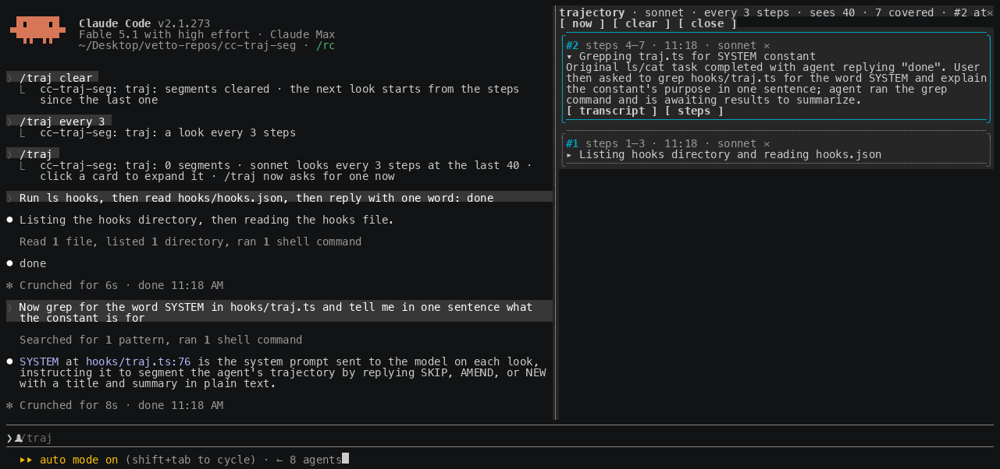

# cc-traj-seg

Trajectory segmentation for long Claude Code sessions: a pane on the right that tells you, in a few cards, what Claude is doing and the path it has taken to get there.

Every N steps (a step is a prompt you typed, an assistant message, or one tool call) a model of your choice reads the segments written so far plus the last 40 steps of the trajectory, and decides one of three things: **SKIP**, the new steps continue the current segment and change nothing worth saying; **AMEND**, they continue it but its title or summary should change; **NEW**, Claude moved to a different action or path. Most looks end in SKIP. That is the point: the pane stays short.



Each card is a one-line title, present tense, of what Claude is doing. Click it to expand the paragraph, a `transcript` button that scrolls the conversation to where the segment starts, and a `steps` button that opens the steps it covers in a second pane. `✕` dismisses a card.


Built on Claude Code **function hooks** ("Claude Mods"), in early access: it needs the environment variable the quick start sets, and the API can change between releases.

## Requirements

- Claude Code 2.1.269 or later, with `CLAUDE_CODE_ENABLE_FUNCTION_HOOKS=1` set.
- An interactive terminal session. For the pane to dock on the right: the fullscreen layout (the default outside tmux) and at least 110 columns. Narrower, the pane sits inline above the prompt.
- The model that writes the segments runs through your session's own credentials. Each look is one short completion, `haiku` by default.

## Quick start

1. Turn function hooks on in `~/.claude/settings.json` (merge the `env` key into what is there):

   ```json
   { "env": { "CLAUDE_CODE_ENABLE_FUNCTION_HOOKS": "1" } }
   ```

2. Load it for one session, from a clone:

   ```sh
   git clone https://github.com/lucastononro/cc-traj-seg
   cd cc-traj-seg
   claude --plugin-dir .
   ```

   or install it as its own marketplace: `claude plugin marketplace add lucastononro/cc-traj-seg` then `claude plugin install cc-traj-seg@cc-traj-seg`.

3. Work as usual. The first segment opens the pane on its own (from 144 columns; narrower, run `/traj` once). `/traj` opens or closes it at any time.

## Commands

| | |
|---|---|
| `/traj` | open or close the pane |
| `/traj now` | ask for a segment of the steps since the last one, right away |
| `/traj every N` | look every N steps (default 10) |
| `/traj window N` | how many of the latest steps the model sees (default 40) |
| `/traj model NAME` | which model writes the segments: `haiku` (default), `sonnet`, `opus`, or a full model id |
| `/traj clear` | drop every segment |
| `/traj stop` | close the pane |
| `/traj help` | the list above, and the current settings |

In the pane: `now`, `clear` and `close` do the same as the commands; a card's title expands it; `transcript` scrolls the conversation to the segment's first row; `steps` opens its steps in a tab that scrolls while it holds the keyboard and closes on Esc; `✕` dismisses the card.

Settings persist across sessions. Segments are kept per session, so `claude --resume` shows the session's own.

## How it works

- `hooks/register.tsx` is the hooks module. It hooks `tool.call` and `turn.complete` to count steps and, when a look is due, calls `$.model.complete` with the segments so far and the step window, without making the turn wait. `ui.render` for `{ component: 'Pane' }` draws the cards, and a second pane for one segment's steps. Hooks on `UserMessage` and `AssistantMessage` renders remember each transcript row's id, which is what `$.ui.scroll` needs to bring the row into view; a tool row is addressed by its tool-use id directly.
- `hooks/traj.ts` is the pure part: the transcript flattened to steps, the window and the prompt, the system prompt, the reply protocol and the argument parser. `tests/traj.test.ts` covers it.

The prompt the model sees, roughly:

```
SEGMENTS SO FAR:
#1 (steps 1-12) Setting up the repo
cloned, installed, tests green

LAST 40 STEPS (52 in the session, 10 new):
[13 user] …
[14 tool] Bash(bun test) → ok: 8 pass
--- NEW STEPS ---
[43 assistant] …
[44 tool] Edit(hooks/register.tsx)

Decision:
```

and it answers `SKIP`, or `NEW` / `AMEND` followed by `TITLE:` and `SUMMARY:` lines.

## Develop

```sh
bun test                                             # or: npx -y bun@1 test
bunx --bun oxlint@1.83.0 hooks tests --deny-warnings
claude plugin validate .claude-plugin/plugin.json    # lists the hooked events and $ calls
```

Type checking needs the early-access types: run `/plugin-types` in a session in this folder (writes the git-ignored `.claude/types/`), then `bunx -p typescript tsc -p .`. Edits hot-reload into a running session; module state resets on a reload, so reopen the pane.

Two things the loader enforces: a helper that receives `$` must be a top-level function declaration in the module, and the engine's own node (`await next(e)`) cannot sit under a Box with a `width`.

The screenshots were captured from a real session driven through tmux (`docs/capture/cast.py` turns `tmux capture-pane -e` frames into an asciicast that agg renders).

## Limits

- The model only sees the last `window` steps plus its own earlier segments, so a segment can misread something that happened further back. That is a trade for a small, cheap prompt.
- `transcript` moves the conversation only for a row the terminal has drawn in this session; on a resumed session older rows may not be addressable, and the steps pane is the fallback.
- Nothing draws in `claude -p`, the desktop app or mobile.

## License

MIT. See [LICENSE](LICENSE).
