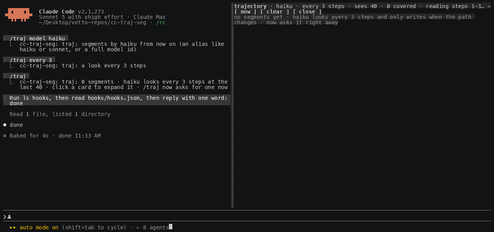
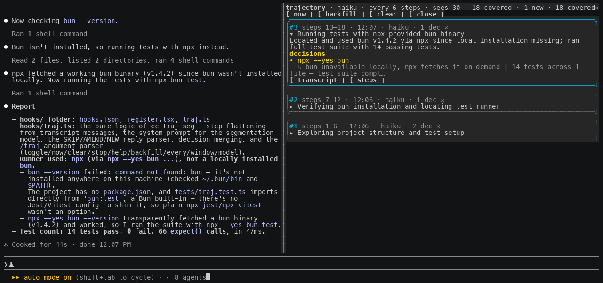
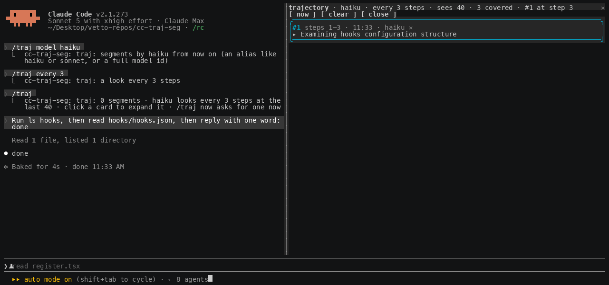
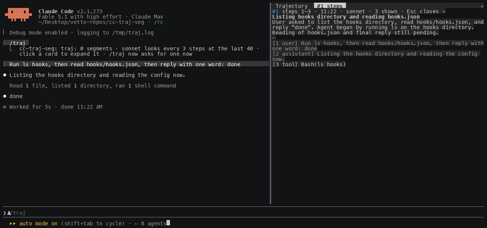
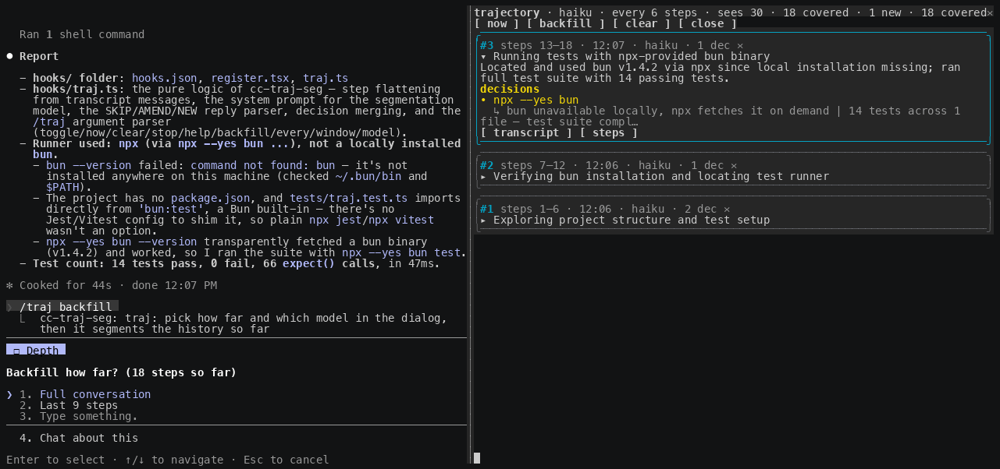

# cc-traj-seg

Trajectory segmentation for long Claude Code sessions: a pane on the right that keeps a running, honest account of what the agent is doing, why, and every decision it makes, broken into short phases you can skim.



## Why this exists

You can delegate intelligence. You cannot delegate understanding.

An agent now runs for tens of minutes and hundreds of tool calls on a single prompt. It reads files, edits them, runs commands, changes direction, recovers from a failed test, and by the time it stops you have a result but no picture of how it got there. The transcript holds every step, yet nobody scrolls back through four hundred lines to reconstruct the plot. So the understanding is simply lost, and you are left trusting an outcome you did not watch being made.

That gap matters more as the models get better, not less. The more capable the agent, the more you hand it, and the more of the actual work happens while you are not looking. Capability you can buy. Legibility you have to build. This plugin spends a little intelligence to buy back the understanding: a small model watches the trajectory and keeps a running outline of the phases the agent moved through, and for each one the decisions it made and the reason behind them, so at any moment you can read the story instead of the log.

It is deliberately cheap to run and worth more than it costs. Paying for a few extra tokens so that a long autonomous run stays explainable is a good trade, and it will look like an obviously good trade as runs get longer. The point of the panel is not to summarise text. It is to make delegation observable, and decisions are the part of a trajectory most worth seeing.

## What you get

- **Short, non-overlapping phases.** Each card is one thing the agent did: a step range, a one-line title, and a one-sentence summary. The model is biased to open a new phase whenever the action, target or goal shifts, so the outline stays fine-grained instead of collapsing into one long block.
- **Decisions, separated from the narration.** Under each phase, every real choice the agent made is listed as the choice and, beneath it, the why. A decision is a choice with alternatives: an approach taken, an option rejected, a fix chosen after a failure, a tool or command picked for a reason.
- **Backfill.** Turned the plugin on late, or want a cleaner pass with a stronger model? The `backfill` button asks how far back to go (up to the whole conversation) and which model and interval to use, then reconstructs the phases over that history.



## How it works

A **step** is one action of the trajectory: a prompt you typed, an assistant message, or a single tool call with the start of what it returned. Every **N steps** (default 6) the plugin runs a look. A look walks the new steps in N-sized chunks, and for each chunk the model reads the phases it has already written (with their decisions) and the recent steps, then answers one of three ways:

- **NEW** — the action, target or goal shifted. A new phase card is pushed. This is the usual answer, which is what keeps the phases short.
- **AMEND** — the newest steps are the direct continuation and result of the same action already in the current phase. Its summary is rewritten and any new decision is added to it.
- **SKIP** — the steps did nothing worth recording. Nothing changes.

Walking the backlog in chunks is deliberate: it stops one look from swallowing a whole multi-step turn into a single coarse block, so each chunk is roughly one action and becomes its own phase.



Each card is a one-line title. Click it to expand the one-sentence summary, the decisions, and two buttons: **transcript** scrolls the conversation to where the phase starts, and **steps** opens the exact steps it covers in a second pane. **✕** dismisses a card.



Built on Claude Code **function hooks** ("Claude Mods"), in early access: it needs the environment variable the quick start sets, and the API can change between releases.

## Requirements

- Claude Code 2.1.269 or later, with `CLAUDE_CODE_ENABLE_FUNCTION_HOOKS=1` set.
- An interactive terminal session. For the pane to dock on the right: the fullscreen layout (the default outside tmux) and at least 110 columns. Narrower, the pane sits inline above the prompt.
- The model that writes the segments runs through your session's own credentials. Each chunk is one short completion, `haiku` by default.

## Quick start

1. Turn function hooks on in `~/.claude/settings.json` (merge the `env` key into what is there):

   ```json
   { "env": { "CLAUDE_CODE_ENABLE_FUNCTION_HOOKS": "1" } }
   ```

2. Load it for one session, from a clone:

   ```sh
   git clone https://github.com/lucastononro/cc-traj-seg
   cd cc-traj-seg
   claude --plugin-dir .
   ```

   or install it as its own marketplace: `claude plugin marketplace add lucastononro/cc-traj-seg` then `claude plugin install cc-traj-seg@cc-traj-seg`.

3. Work as usual. The first phase opens the pane on its own (from 144 columns; narrower, run `/traj` once). `/traj` opens or closes it at any time.

## Backfill

If the plugin was not running from the start of a session, or you want to re-segment the history with a different model, press **backfill** in the pane (or run `/traj backfill`). A dialog asks three things and then rebuilds the phases:

1. **How far** — the whole conversation, or the last N steps (or type your own).
2. **Which model** — the current one, `haiku`, `sonnet`, `opus`, or a full id typed under "Other".
3. **Every how many steps** — the chunk size for the reconstruction.

The answers also become the ongoing settings, and live segmentation continues from the present once the backfill finishes.



## Commands

| | |
|---|---|
| `/traj` | open or close the pane |
| `/traj now` | segment the steps since the last phase, right away |
| `/traj backfill` | segment the history so far (asks how far, which model, and N) |
| `/traj every N` | look every N steps (default 6) |
| `/traj window N` | how many of the latest steps the model sees per chunk (default 40) |
| `/traj model NAME` | which model writes the phases: `haiku` (default), `sonnet`, `opus`, or a full id |
| `/traj clear` | drop every phase |
| `/traj stop` | close the pane |
| `/traj help` | the list above, and the current settings |

In the pane, `now`, `backfill`, `clear` and `close` mirror the commands; a card's title expands it; `transcript` scrolls the conversation to the phase's first row; `steps` opens its steps in a tab that scrolls while it holds the keyboard and closes on Esc; `✕` dismisses the card.

Settings persist across sessions. Phases are kept per session, so `claude --resume` shows the session's own.

## Tuning

- **N (every).** Smaller means more phases, finer-grained, at more model calls; larger is coarser and cheaper. Six is fine-grained by default; raise it if you want fewer, broader phases.
- **Model.** `haiku` is enough to name a phase and its decisions cheaply. Switch to `sonnet` for a run you care about, or backfill the whole conversation with `sonnet` at the end for a clean narrative.
- **Window (sees).** How many recent steps the model reads per chunk, on top of its own earlier phases. Raise it if a phase misreads something that happened a little earlier.

## Internals

- `hooks/register.tsx` is the hooks module. It hooks `tool.call` and `turn.complete` to count steps and, when a look is due, walks the backlog in `every`-sized chunks, calling `$.model.complete` for each without making the turn wait. `ui.render` for `{ component: 'Pane' }` draws the cards and a second pane for one phase's steps; the backfill dialog is `$.ui.ask`. Hooks on `UserMessage` and `AssistantMessage` renders remember each transcript row's id for the transcript button; a tool row is addressed by its tool-use id directly.
- `hooks/traj.ts` is the pure part: the transcript flattened to steps, the window and the prompt, the system prompt, the SKIP/AMEND/NEW reply protocol, the choice-and-why decision parsing, decision merging, and the argument and dialog-answer parsers. `tests/traj.test.ts` covers it.

## Develop

```sh
bun test                                             # or: npx -y bun@1 test
bunx --bun oxlint@1.83.0 hooks tests --deny-warnings
claude plugin validate .claude-plugin/plugin.json    # lists the hooked events and $ calls
```

Type checking needs the early-access types: run `/plugin-types` in a session in this folder (writes the git-ignored `.claude/types/`), then `bunx -p typescript tsc -p .`. Edits hot-reload into a running session; module state resets on a reload, so reopen the pane.

Two things the loader enforces: a helper that receives `$` must be a top-level function declaration in the module, and the engine's own node (`await next(e)`) cannot sit under a Box with a `width`.

The screenshots and the gif were captured from a real session driven through tmux (`docs/capture/cast.py` turns `tmux capture-pane -e` frames into an asciicast that agg renders).

## Limits

- One chunk yields at most one phase, so the finest granularity is one phase per N steps; lower N for finer.
- The model sees only the recent steps plus its own earlier phases, so a phase can misread something further back. That is the trade for a small, cheap prompt.
- `transcript` moves the conversation only for a row the terminal has drawn in this session; on a resumed session older rows may not be addressable, and the steps pane is the fallback.
- Nothing draws in `claude -p`, the desktop app or mobile.

## License

MIT. See [LICENSE](LICENSE).
