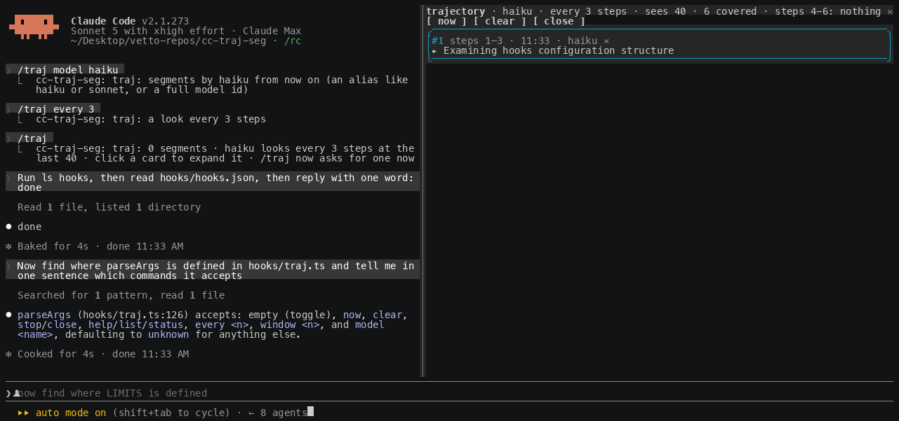

# cc-traj-seg

Trajectory segmentation for long Claude Code sessions: a pane on the right that tells you, in a few cards, what Claude is doing and the path it has taken to get there.


## Why this exists

You can delegate intelligence. You cannot delegate understanding.

An agent now runs for tens of minutes and hundreds of tool calls on a single prompt. It reads files, edits them, runs commands, changes direction, recovers from a failed test, and by the time it stops you have a result but no picture of how it got there. The transcript holds every step, yet nobody scrolls back through four hundred lines to reconstruct the plot. So the understanding is simply lost, and you are left trusting an outcome you did not watch being made.

That gap matters more as the models get better, not less. The more capable the agent, the more you hand it, and the more of the actual work happens while you are not looking. Capability you can buy. Legibility you have to build. This plugin spends a little intelligence to buy back the understanding: a small model watches the trajectory and keeps a running, honest account of what the main agent is doing and why, so at any moment you can read the story instead of the log.

It is deliberately cheap to run and worth more than it costs. Paying for a few extra tokens so that a long autonomous run stays explainable is a good trade, and it will look like an obviously good trade as runs get longer. The point of the panel is not to summarise text. It is to make delegation observable.

## How it works

A **step** is one action of the trajectory: a prompt you typed, an assistant message, or a single tool call with the start of what it returned. Every **N steps** (default 10) the plugin runs one look. On each look a model of your choice reads two things: the segments it has already written, and the **last W steps** of the trajectory (default 40), with a marker before the ones that are new since the last look. That overlap of old context and new steps is what lets it judge continuity rather than summarise blindly.

It then answers one of three ways:

- **SKIP** — the new steps continue the current segment and add nothing worth saying. Most looks end here, which is the point: the pane stays short.
- **AMEND** — the same phase, but its title or summary should change (a result came back, a blocker appeared). The current card is rewritten in place.
- **NEW** — the agent moved to a different action or path. A new card goes on top.

Each card is a one-line, present-tense title of what Claude is doing. Click the title to expand a short paragraph and two buttons: **transcript** scrolls the conversation to where the segment starts, and **steps** opens the exact steps it covers in a second pane. **✕** dismisses a card.





Built on Claude Code **function hooks** ("Claude Mods"), in early access: it needs the environment variable the quick start sets, and the API can change between releases.

## Requirements

- Claude Code 2.1.269 or later, with `CLAUDE_CODE_ENABLE_FUNCTION_HOOKS=1` set.
- An interactive terminal session. For the pane to dock on the right: the fullscreen layout (the default outside tmux) and at least 110 columns. Narrower, the pane sits inline above the prompt.
- The model that writes the segments runs through your session's own credentials. Each look is one short completion, `haiku` by default.

## Quick start

1. Turn function hooks on in `~/.claude/settings.json` (merge the `env` key into what is there):

   ```json
   { "env": { "CLAUDE_CODE_ENABLE_FUNCTION_HOOKS": "1" } }
   ```

2. Load it for one session, from a clone:

   ```sh
   git clone https://github.com/lucastononro/cc-traj-seg
   cd cc-traj-seg
   claude --plugin-dir .
   ```

   or install it as its own marketplace: `claude plugin marketplace add lucastononro/cc-traj-seg` then `claude plugin install cc-traj-seg@cc-traj-seg`.

3. Work as usual. The first segment opens the pane on its own (from 144 columns; narrower, run `/traj` once). `/traj` opens or closes it at any time.

## Commands

| | |
|---|---|
| `/traj` | open or close the pane |
| `/traj now` | ask for a segment of the steps since the last one, right away |
| `/traj every N` | look every N steps (default 10) |
| `/traj window N` | how many of the latest steps the model sees (default 40) |
| `/traj model NAME` | which model writes the segments: `haiku` (default), `sonnet`, `opus`, or a full model id |
| `/traj clear` | drop every segment |
| `/traj stop` | close the pane |
| `/traj help` | the list above, and the current settings |

In the pane: `now`, `clear` and `close` do the same as the commands; a card's title expands it; `transcript` scrolls the conversation to the segment's first row; `steps` opens its steps in a tab that scrolls while it holds the keyboard and closes on Esc; `✕` dismisses the card.

Settings persist across sessions. Segments are kept per session, so `claude --resume` shows the session's own.

## Choosing the model, N and the window

- **Model.** `haiku` is the default because a look happens often and each one should be cheap; it is enough to name a phase and spot a change of direction. Switch to `sonnet` for finer, better-written segments on a run you care about, or a full id to pin a version. This is where the "pay a little to understand" trade lives.
- **N (every).** Smaller means more looks and finer segments, at more calls; larger means coarser and cheaper. Ten is a reasonable middle; drop to three or four while you are watching closely.
- **Window (sees).** The model reads only the last W steps plus its own earlier segments, so W is how far back it can see raw. Forty covers a few turns of context. Raise it if segments misread something that happened further back, at the cost of a bigger prompt each look.

## Internals

- `hooks/register.tsx` is the hooks module. It hooks `tool.call` and `turn.complete` to count steps and, when a look is due, calls `$.model.complete` with the segments so far and the step window, without making the turn wait. `ui.render` for `{ component: 'Pane' }` draws the cards, and a second pane for one segment's steps. Hooks on `UserMessage` and `AssistantMessage` renders remember each transcript row's id, which is what `$.ui.scroll` needs to bring the row into view; a tool row is addressed by its tool-use id directly.
- `hooks/traj.ts` is the pure part: the transcript flattened to steps, the window and the prompt, the system prompt, the reply protocol and the argument parser. `tests/traj.test.ts` covers it.

The prompt the model sees, roughly:

```
SEGMENTS SO FAR:
#1 (steps 1-12) Setting up the repo
cloned, installed, tests green

LAST 40 STEPS (52 in the session, 10 new):
[13 user] …
[14 tool] Bash(bun test) → ok: 8 pass
--- NEW STEPS ---
[43 assistant] …
[44 tool] Edit(hooks/register.tsx)

Decision:
```

and it answers `SKIP`, or `NEW` / `AMEND` followed by `TITLE:` and `SUMMARY:` lines.

## Develop

```sh
bun test                                             # or: npx -y bun@1 test
bunx --bun oxlint@1.83.0 hooks tests --deny-warnings
claude plugin validate .claude-plugin/plugin.json    # lists the hooked events and $ calls
```

Type checking needs the early-access types: run `/plugin-types` in a session in this folder (writes the git-ignored `.claude/types/`), then `bunx -p typescript tsc -p .`. Edits hot-reload into a running session; module state resets on a reload, so reopen the pane.

Two things the loader enforces: a helper that receives `$` must be a top-level function declaration in the module, and the engine's own node (`await next(e)`) cannot sit under a Box with a `width`.

The screenshots and the gif were captured from a real session driven through tmux (`docs/capture/cast.py` turns `tmux capture-pane -e` frames into an asciicast that agg renders).

## Limits

- The model only sees the last `window` steps plus its own earlier segments, so a segment can misread something that happened further back. That is the trade for a small, cheap prompt.
- Because later looks inherit earlier segments as context, a misdescription can carry forward. Raising the window helps.
- `transcript` moves the conversation only for a row the terminal has drawn in this session; on a resumed session older rows may not be addressable, and the steps pane is the fallback.
- Nothing draws in `claude -p`, the desktop app or mobile.

## License

MIT. See [LICENSE](LICENSE).
